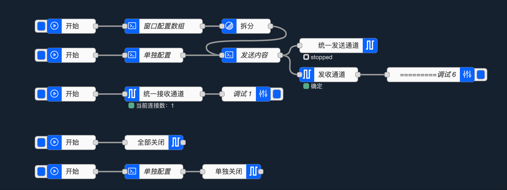

node-zserialport
========================

<a href="http://nodered.org" target="noderedinfo">Node-RED</a> 节点，用于与硬件串口通信。

## 安装

要安装稳定版本，可以使用 `菜单 - 管理调色板 - 安装` 选项并搜索 node-zserialport，或者在你的 Node-RED 用户目录（通常为 `~/.node-red`）下运行以下命令：

  npm i node-zserialport

安装过程中可能会出现多条关于可选编译的消息。
这些消息看起来像是失败……因为它们报告为编译错误失败——但通常只是警告，节点会继续安装，如果没有其他错误，你应该可以正常使用。有些平台*确实*需要你安装完整的工具集来编译底层包。

## 用法

提供四个节点——一个用于接收消息，一个用于发送，一个请求节点可以发送并等待响应，还有一个关闭所使用的端口。

### 输入

从本地串口读取数据。

点击搜索图标会尝试自动检测连接到设备的串口，但你可能需要手动指定，比如 COM1、/dev/ttyUSB0 等。

它可以：

 - 等待一个“分隔”字符（默认 \n），也接受十六进制表示（0x0a）。
 - 等待从接收到第一个字符起的超时时间（毫秒）
 - 等待填满一个固定大小的缓冲区

然后会将 `msg.payload` 输出为 UTF8 ascii 字符串或二进制 Buffer 对象。

如果没有指定分隔字符，或超时时间或缓冲区大小为 0，则会以流的形式发送单个字符——同样可以是 ascii 字符或长度为 1 的二进制 buffer。

### 输出

提供一个到外部串口的连接。

只会发送 `msg.payload`。

可选地，可以将用于分割输入的字符附加到每条发送到串口的消息后面。

### 请求

提供一个请求/响应串口的连接。

该节点行为类似于串口输入和输出节点的紧密结合，并共享配置。

像使用串口输出节点一样，将请求消息放在 `msg.payload` 中发送。消息会按照严格的 FIFO（先进先出）队列转发到串口，等待单个响应后才会发送下一个请求。一旦收到响应（逻辑同串口输入节点），或超时发生，就会在输出端产生一条消息，msg.payload 包含收到的响应（或超时时为空），msg.status 包含相关信息，其他字段保持不变。

为了与串口输入节点保持一致，msg.port 也会被设置为所选端口的名称。

### 控制

当 node-red 启动时，流程（程序）会选取预设的串口，打开并开始通信。但有些情况下需要切换到不同的端口、停止并重新启动。例如，为 Arduino 上传新固件时，需要先停止串口、释放串口，然后上传后再重新启动。或者当 FTDI 设备因某种原因断开后重新连接，端口号可能会变化，流程的最终用户无法更改端口。

该节点提供以下能力：

  1. 在运行时以编程方式更改串口及其配置。
  2. 停止通信并释放串口。
  3. 重新打开端口并重启通信。

要控制通信，向控制节点发送 **msg.payload**。

  {
  "serialport": "/dev/ttyUSB0",
  "serialbaud": 115200,
  "databits": 8,
  "parity": "none",
  "stopbits": 1,
  "enabled": true
  }

可以动态更改串口及其配置。

以下可选参数仅在存在时更改配置。
可以任意组合传递它们来更改/控制串口通信：

 - serialport
 - serialbaud
 - databits
 - parity
 - stopbits
 - dtr
 - rts
 - cts
 - dsr
 - enabled

如果未提供 `enabled` 属性，则默认为 `true`。

`{"enabled":true}` 或 `{"enabled":false}` 将启动或停止通信。

如果 `enabled` 与其他参数一起传递，则会更改配置，并根据其值启动或保持停止，准备稍后启动。

任何输入消息都会导致节点输出当前端口配置。

### MAC

mac 模拟串口

***
socat -d -d pty,raw,echo=0 pty,raw,echo=0

socat -d -d pty,raw,echo=0 pty,raw,echo=0 | socat -d -d -d -d pty,raw,echo=0
***

连接串口 

***
screen /dev/ttys003 9600
***